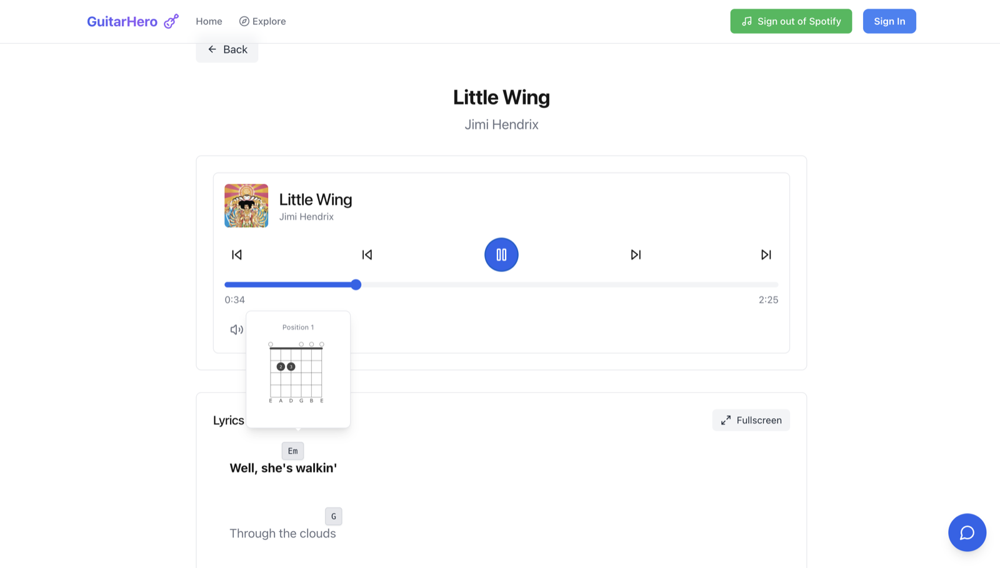
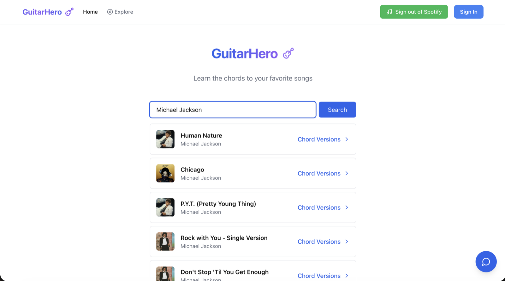

# GuitarHero

A web app for learning songs on guitar. You search for a track, and GuitarHero plays it back with the lyrics scrolling in time and the chords sitting above the words where they actually change, so you can practice without pausing to scroll a tab in another window.

I built it in the summer of 2025 while learning guitar. The problem I kept hitting was that the audio and the chord sheet lived in two different places; this is my attempt at putting them together.



## How it works

**Playback.** Audio runs through the Spotify Web Playback SDK, so the browser tab is its own Spotify device rather than a remote for one. Authentication is NextAuth with Spotify OAuth. The player polls its position twice a second and passes it up to the lyric sheet.

**Lyrics.** Timed lyrics come from [LRCLIB](https://lrclib.net) as LRC files, which get parsed into timestamped lines and cached in Postgres so a song is only fetched once. The active line highlights and auto-scrolls as the track plays, and there's a fullscreen mode for practicing.

**Chords.** Chords aren't scraped — users write them. In the editor you add a chord and click a point on a lyric line to place it; the placement is stored as a percentage offset so it holds up at any screen width. Fingering diagrams come from `chords-db`, including alternate voicings for the same chord. A song can have several versions, and one can be featured.



Data lives in Supabase. Songs are keyed by Spotify ID with their lyrics cached as `jsonb`; each arrangement is a row in `song_edits` holding its chord placements as a `jsonb` array, so one query loads a whole version. Row-level security handles access: reads are public, writes are scoped to `auth.uid() = user_id`, and featuring a version is gated behind an admin flag on the user's profile.

There's also a chat assistant (LangChain + OpenAI) that receives the current song and its chords as context, for questions like why a voicing is fingered a particular way.

## Stack

Next.js 15, React 19, TypeScript, Tailwind, NextAuth, Supabase (Postgres), Spotify Web Playback SDK, `@tombatossals/chords-db`.

## Running it locally

You'll need a Spotify developer app and a Supabase project. **Spotify Premium is required** — the Web Playback SDK won't stream without it.

```bash
npm install
npm run dev
```

Add `http://localhost:3000/api/auth/callback/spotify` as a redirect URI in the Spotify dashboard, then create `.env.local`:

```env
SPOTIFY_CLIENT_ID=
SPOTIFY_CLIENT_SECRET=
NEXTAUTH_SECRET=
NEXTAUTH_URL=http://localhost:3000

NEXT_PUBLIC_SUPABASE_URL=
NEXT_PUBLIC_SUPABASE_ANON_KEY=
SUPABASE_SERVICE_ROLE_KEY=

OPENAI_API_KEY=
```

The Supabase side needs four tables — `songs`, `song_edits`, `profiles`, and `genres` — plus RLS policies. Migration files aren't checked in yet.

## Known rough edges

- Requires Spotify Premium, which rules out a lot of people trying it.
- Songs without synced lyrics on LRCLIB fall back to nothing; there's no manual timing editor.
- No test suite.
